## Dbeaver Setup 

DBeaver Community is a free cross-platform database tool for developers, database administrators, analysts, and everyone working with data. It supports all popular SQL databases like MySQL, MariaDB, PostgreSQL, SQLite, Apache Family, and more. You can other database tool like [pgAdmin](https://www.pgadmin.org/) 

## Initial configuration 

After starting your docker container your dbeaver will be available at : http://localhost:8080/ 

- Hit endpoint where dbeaver is running i.e. 8080 port from docker-compose 

    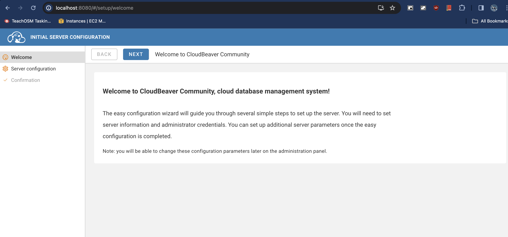

- Click on Next and navigate to ADMINISTRATOR CREDENTIALS

    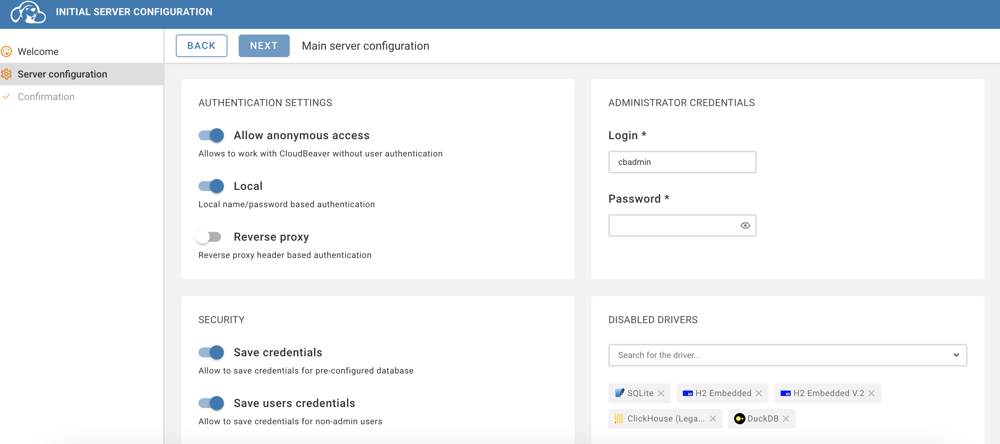

- Setup your login and password & Hit Next

    Mindful to remember this, You will be using it when you login to dbeaver next time 

- Hit Finish 
    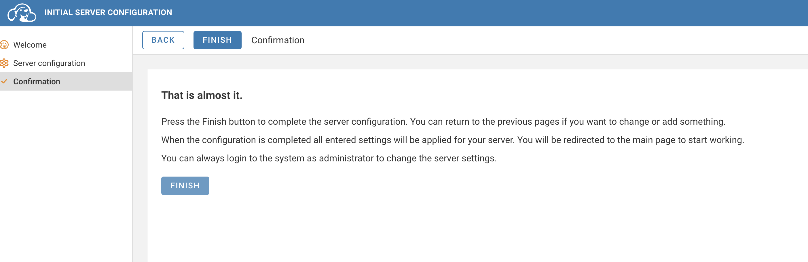

- After finish you will be promoted to enter your username and password that you created earlier

    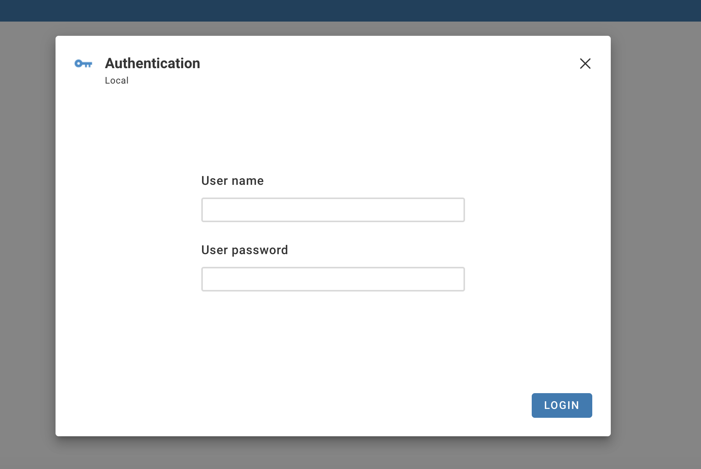

- Once you are logged in you will see following screen click on top left icon

    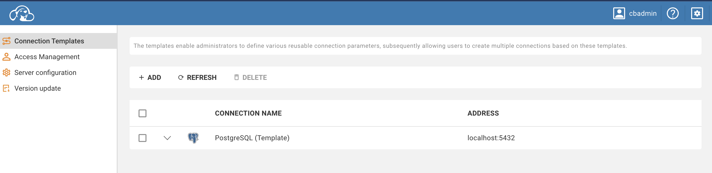

- This is your query section where you would be instatntiating connections , Shoot query and visualize 

    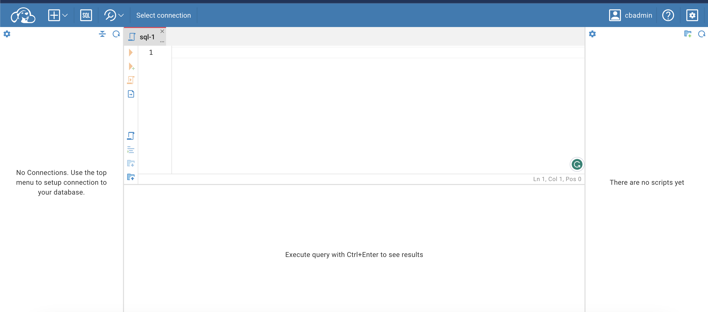


## Connection and Query 

- Click on + Icon on top left bar , Hit New Connection

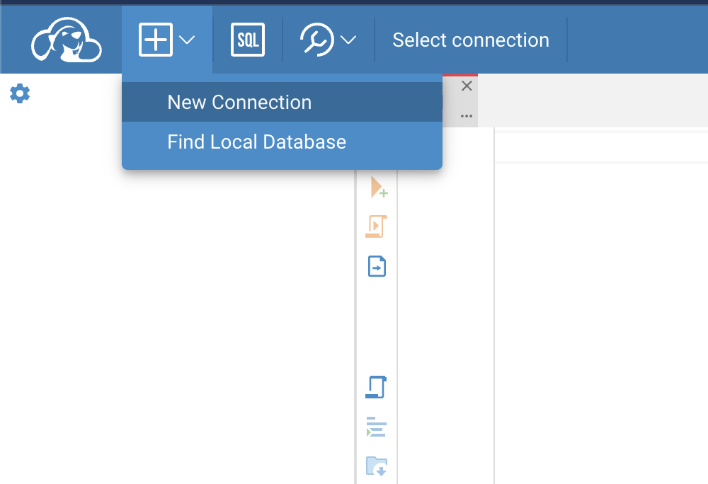

- Choose Postgresql , you can use other connections as well such as duckdb 

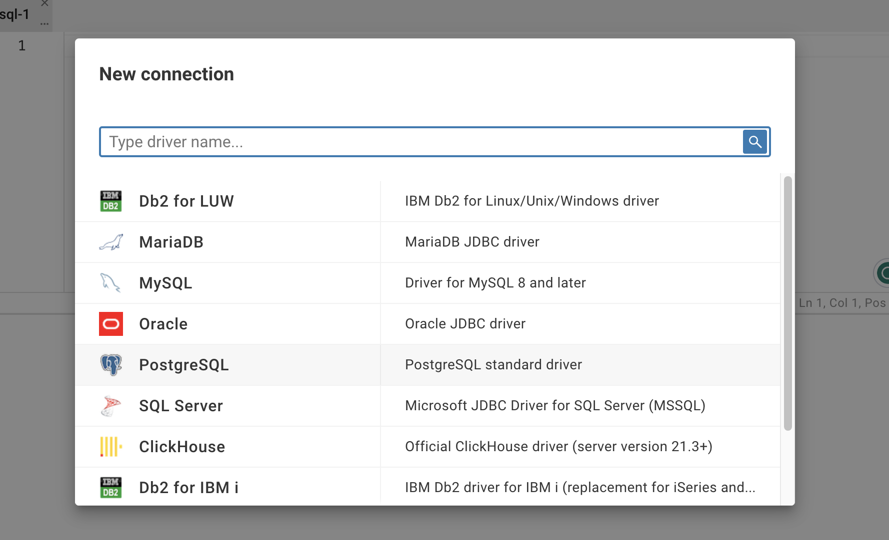

- Configure following : 

Those configurations are from docker compose, You can change these to your local if you have any 
```
Host : postgis-docker
User Name : myuser
Password : mypassword
```
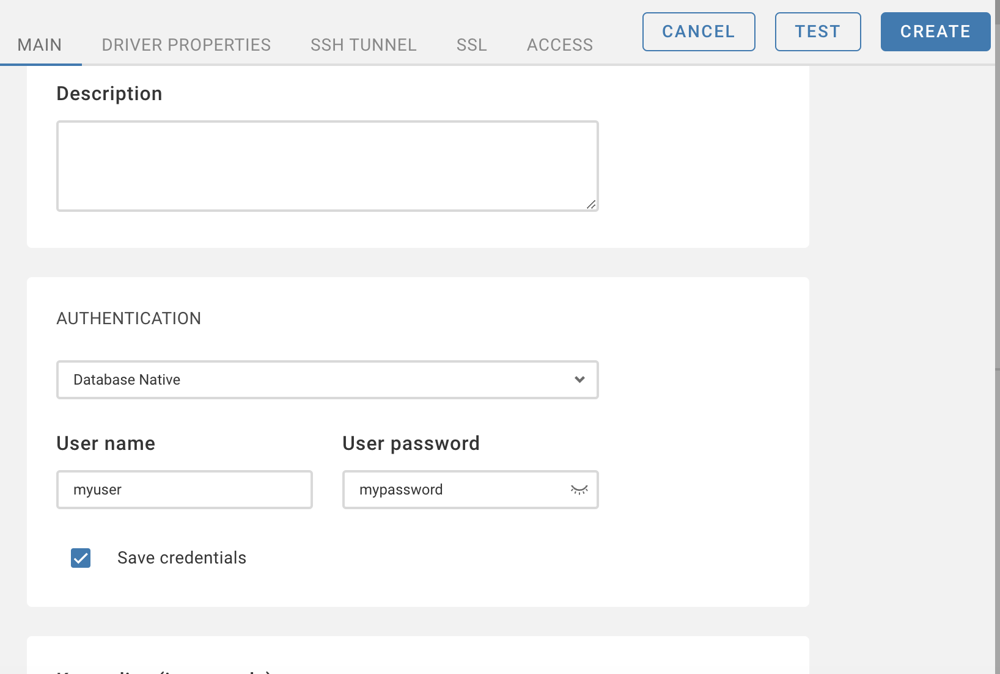

- Fill above in the form box & Hit Test , You should be promoted following box

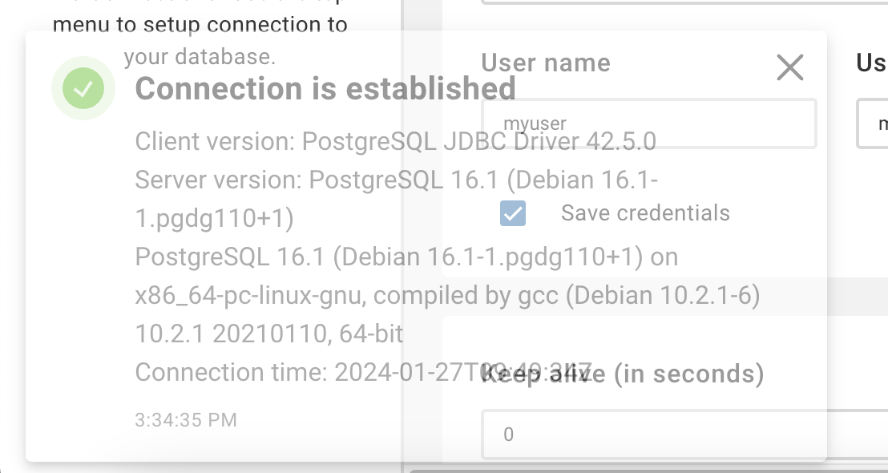

- Now finally hit Create ! 

- Expand your connections which will be in left side of your screen , you should be able to see pokhara table 

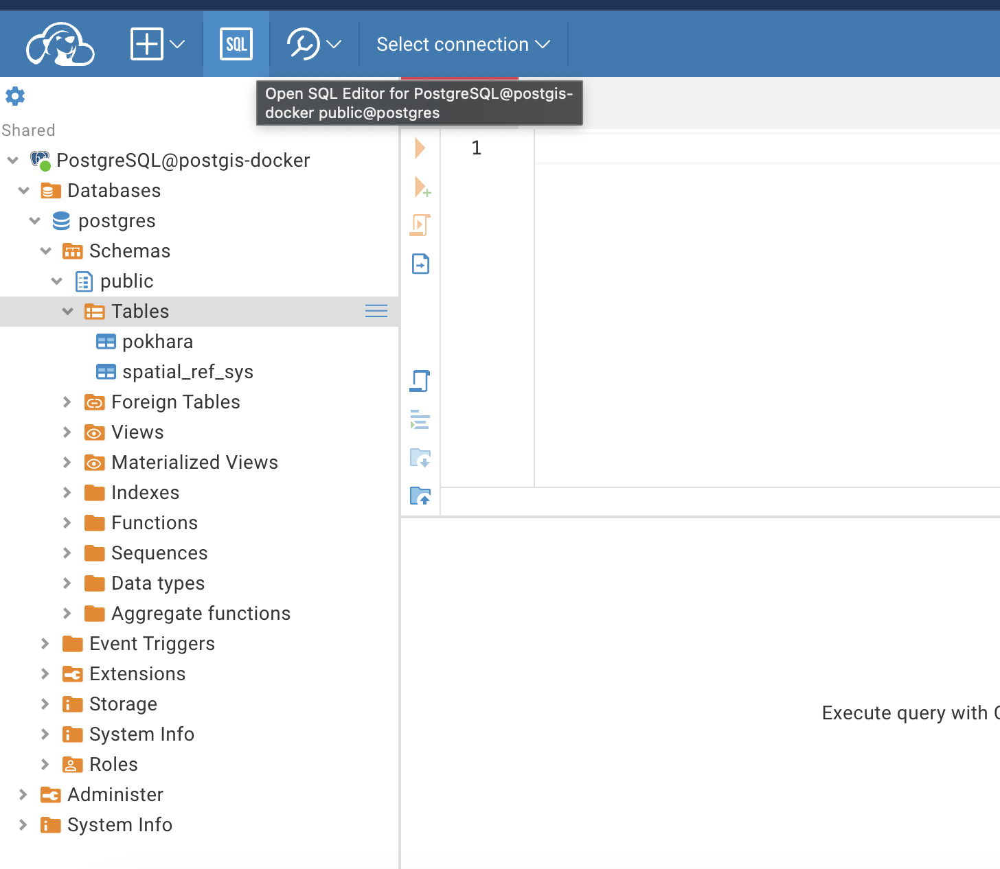

### Queries

- Click on SQL button on top left bar , You will be promoted to Query window . Where we will be playing with our data . Click on Select connection and choose your postgis-docker connection

