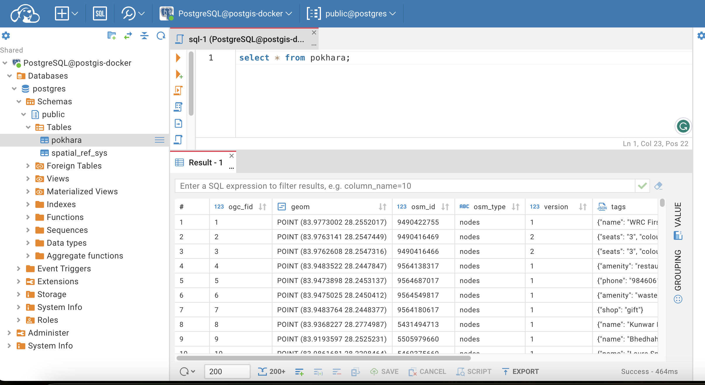
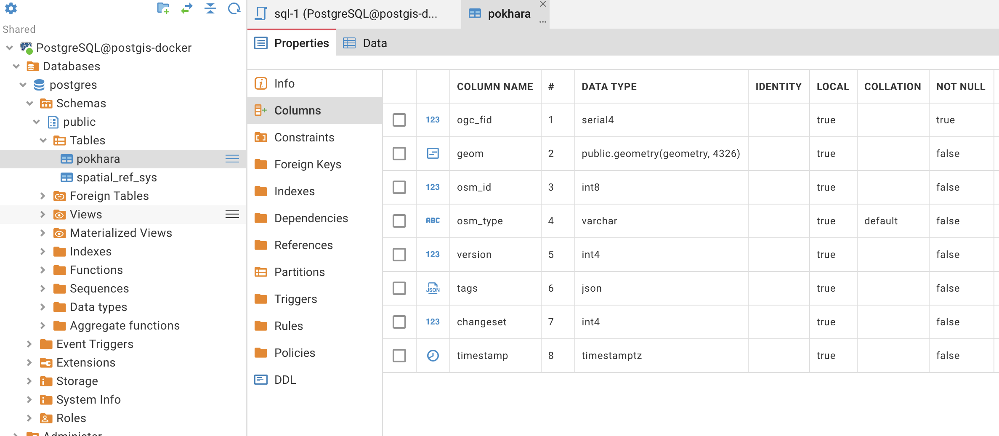
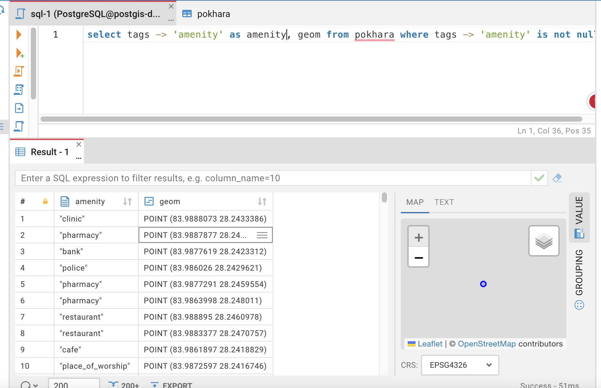
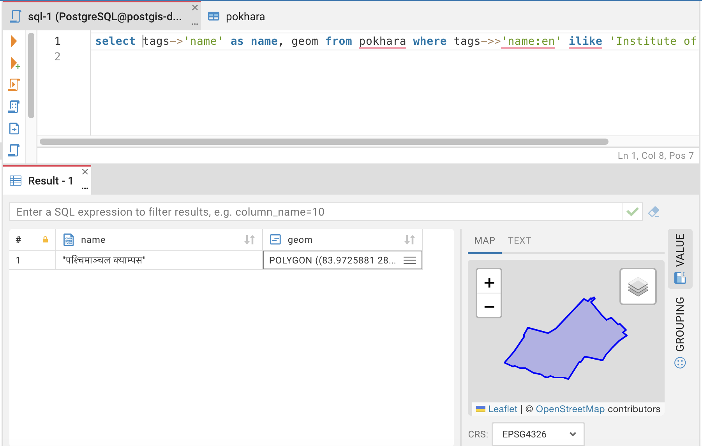
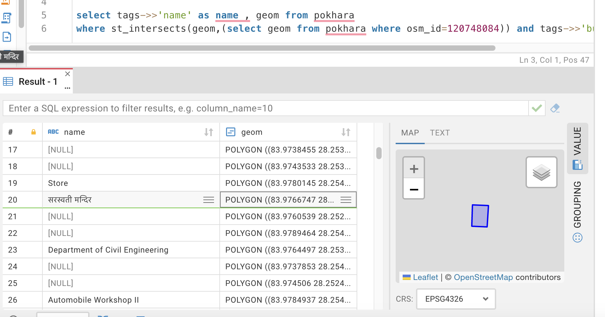
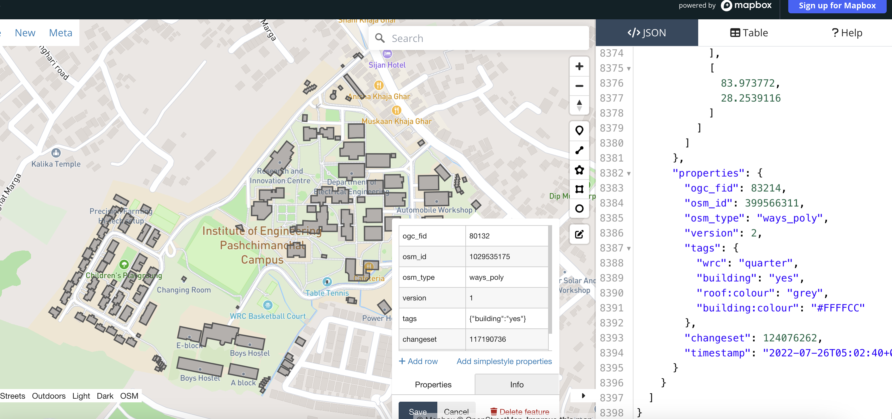

# Queries & Tables 
We won't go in deeper in this exercise, we will only go through some query example to learn how to filter, visualize & how to use spatial functions
## Basic table visualization
Once you have query window open, Make sure you have selected your postgis-docker connection and you can visualize table data like following 

Shoot following query to see everything in table 
``` sql
select * from pokhara;
```




- Know your table , How tables are created 

Click on pokhara and click on open , Navigate to properties



Here you can see tags are of type json , geom is type of geometry type etc. 

Learn about tables basic form [here](https://www.postgresql.org/docs/current/ddl-basics.html) , Try out some queries by yourself ot create tables , play with them 

## Filters 

There are multiple postgresql filters available, Read through [documentation](https://www.postgresql.org/docs/current/logical-replication-row-filter.html) 

Let's try to filter all amenities in pokhara

```sql
select tags -> 'amenity' as amenity, geom from pokhara where tags -> 'amenity' is not null 
```
Toggle Value on right vertical bar and click on geom to visualize geomtery



Similarly you can perform different spatial filters within the table to retrieve results

Lets find Paschimanchal campus in database. Learn about [ilike functions](https://www.postgresql.org/docs/7.3/functions-matching.html#:~:text=The%20keyword%20ILIKE%20can%20be,and%20~~*%20corresponds%20to%20ILIKE%20.)
```sql
select tags->'name' as name, geom from pokhara where tags->>'name:en' ilike 'Institute of Engineering%' 
```

You should see your filtered row like following 


You can see all other attributes of the rows if you want using ```select *```

## Spatial functions 

[Documentation and reference](https://postgis.net/docs/reference.html) 

As we figured out boundary of pashchimanchal campus it has ```osm_id``` of ```120748084```

```sql
select * from pokhara
where osm_id = 120748084
```

We will use this boundary to learn about spatial functions 

- Let's select all builidngs inside pashchimanchal campus

```sql
select tags->>'name' as name , geom from pokhara 
where st_intersects(geom,(select geom from pokhara where osm_id=120748084)) and tags->>'building' is not null
```

Here on this query we are selecting name & geom from the table as attribute . We are applying filter as getting all only building features which intersects campus boundary 



- Get features as geojson 

```sql
select json_build_object(
    'type', 'FeatureCollection',
    'features', json_agg(ST_AsGeoJSON(p.*)::json)
  ) 
from pokhara p
where st_intersects(geom,(select geom from pokhara where osm_id=120748084)) and tags->>'building' is not null
```

You can copy the result and visualize geojosn in your fav visualizer 

